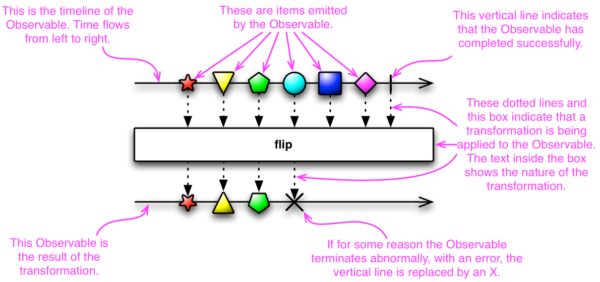
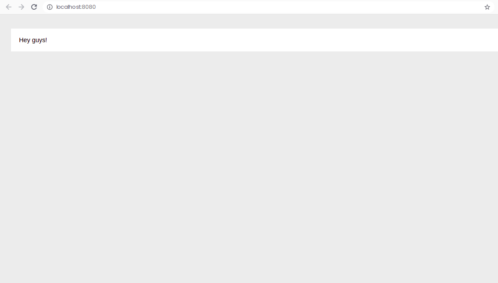

# Observables, Observers & Subscriptions

---

# 

## What is a Stream?

A stream in the RxJS world simply represents <span style="color:#EF6C00">**values over time**</span>.

example: user filling out different form fields in a form, users sending chat messages etc.

Stream is simply a concept and Observables are what facilitates a stream.

## Observables, Observers & Subscriptions

- An observable is a function that produces a stream of values to an observer over time.
- When you subscribe to an observable, you are an observer.
- An observable can have multiple observers.

This is just basics of the relationship between observables, observers and subscriptions.

## Creating an Observable

Open up /src/code.ts and specify the following:

```
var observable = new Observable((observer: any) => {
  observer.next("Hey guys!");
});
```

This, is an observable, which accepts a single argument, which is a subscribe function. This subscribe function accepts an observer argument.

Above, you can see that we're defining the subscribe function, and we're emitting a single value of 'Hey guys!' by calling observer.next().

Now, how can we subscribe or create a subscription to this observable

```
var observable = new Observable((observer: any) => {
  observer.next("Hey guys!");
});

observable.subscribe((x: any) => addItem(x));

// Function create HTML elements

function addItem(val: any) {
  var node = document.createElement("li");
  var textnode = document.createTextNode(val);
  node.appendChild(textnode);
  document.getElementById("output").appendChild(node);
}
```

Now, ensure that you've ran **npm start** in your console and visit **http://localhost:8080**

You will see the value emitted from the observer, 'Hey guys!'.

# 
